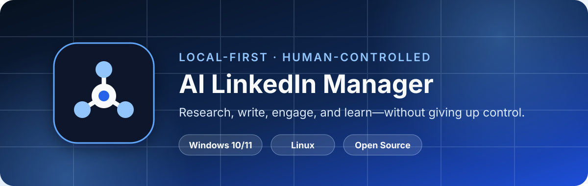
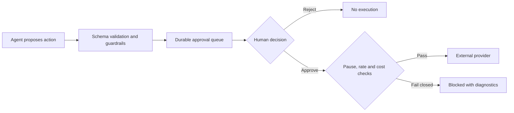
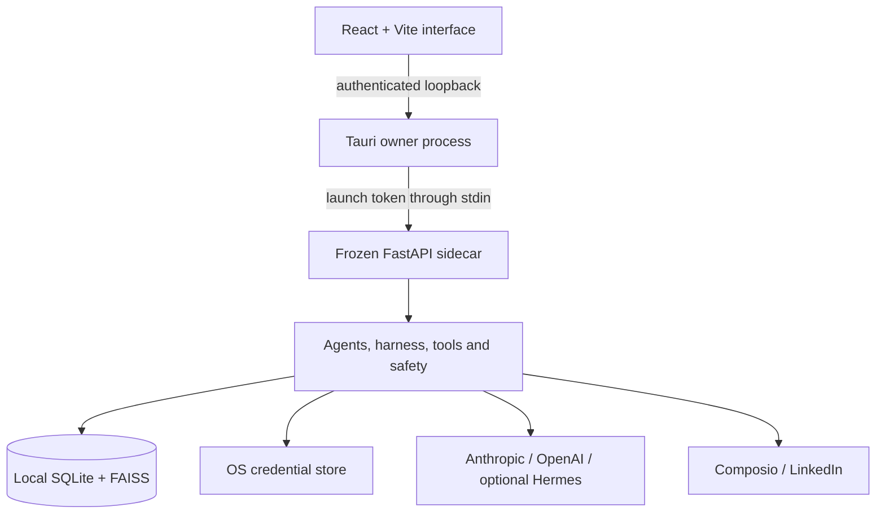

<p align="center">
  
</p>

<h1 align="center">AI LinkedIn Manager</h1>

<p align="center">
  A local-first desktop workspace where five specialized AI agents help research, write, engage, and analyze—while every consequential LinkedIn action remains under human control.
</p>

<p align="center">
  <a href="https://github.com/codaswin/ALM_opensourse/releases/latest"></a>
  <a href="https://github.com/codaswin/ALM_opensourse/actions/workflows/ci.yml"></a>
  
  
  <a href="LICENSE"></a>
</p>

<p align="center">
  <a href="https://github.com/codaswin/ALM_opensourse/releases/latest"><strong>Download</strong></a>
  · <a href="#quick-start"><strong>Quick start</strong></a>
  · <a href="#how-it-works"><strong>How it works</strong></a>
  · <a href="docs/architecture.md"><strong>Architecture</strong></a>
  · <a href="https://github.com/codaswin/ALM_opensourse/issues"><strong>Report an issue</strong></a>
</p>

---

## Why this exists

Most social automation asks you to hand an agent the keys and hope it behaves. AI LinkedIn Manager takes the opposite approach: agents can research, plan, draft, and recommend, but publishing, scheduling, deleting, replying, sending DMs, and sending connection requests require explicit approval.

The application runs on your computer, stores working data in local SQLite databases, and keeps credentials in the operating system's secure credential store. It does not require a separately managed Python server, PostgreSQL database, or Redis instance after installation.

## Highlights

- **Five focused agents** for strategy, writing, engagement, analytics, and multi-source research.
- **Human approval by construction** for all six externally consequential tools.
- **Local-first desktop runtime** powered by Tauri, React, FastAPI, SQLite, and a bundled Python sidecar.
- **Native credential storage** through Windows Credential Manager or Linux Secret Service—never plaintext SQLite or browser storage.
- **Bring your own model provider** with Anthropic or OpenAI support and an optional self-hosted Hermes worker tier.
- **Six research sources**: Hacker News, Reddit, GitHub, Product Hunt, RSS, and web search, with optional X research.
- **Cost and rate controls**, a global pause switch, refusal-topic guardrails, tracing, evals, and reviewed self-learning.
- **597 automated tests** that run without live LinkedIn or model credentials.

## Download

| Platform | Installer | Support status |
|---|---|---|
| Windows 10/11 x64 | `.exe` setup or `.msi` | Early support; built by the native Windows release workflow. Clean-machine smoke testing is still in progress. |
| Linux x64 | `.AppImage`, `.deb`, or `.rpm` | Built and smoke-tested on Linux. |
| macOS | Build from source | No published installer yet. |

Download installers from the [latest GitHub Release](https://github.com/codaswin/ALM_opensourse/releases/latest).

> [!IMPORTANT]
> Current installers are unsigned. Only download them from this repository's GitHub Releases page. Windows SmartScreen may show an **Unknown publisher** warning; Linux package tools may show a similar trust warning. Code signing and automatic updates are not configured yet.

### Windows

For most people, download the Windows setup `.exe` from the Releases page. The `.msi` is also available for managed or scripted installation.

You can alternatively run the repository's installer helper in PowerShell:

```powershell
irm https://raw.githubusercontent.com/codaswin/ALM_opensourse/main/install.ps1 | iex
```

The helper finds the latest `.msi`, downloads it to your temporary directory, and opens the standard Windows installer. If SmartScreen intervenes, review the source and publisher information before choosing **More info → Run anyway**.

Requirements for the installed app:

- Windows 10 or Windows 11, x64
- Microsoft Edge WebView2 Runtime, normally already installed
- Internet access for the model provider, Composio, and live research sources you enable

Python, Node.js, Rust, PostgreSQL, and Redis are **not** required to use the installed application.

### Linux

Run the one-line installer:

```bash
curl -fsSL https://raw.githubusercontent.com/codaswin/ALM_opensourse/main/install.sh | bash
```

It selects a `.deb` for Debian/Ubuntu, an `.rpm` for Fedora-family systems, or an `.AppImage` fallback. You can also download any package directly from the Releases page.

## Quick start

1. Install and open AI LinkedIn Manager.
2. Complete the short local onboarding—there is no hosted account or application password.
3. Open **Connections** and add an Anthropic or OpenAI API key.
4. Add your Composio API key and LinkedIn connected-account ID.
5. Use **Test connection** to validate each saved credential against its provider.
6. Create a profile in **Brand Voice** so generated posts match your writing style.
7. Start a research, content, analytics, or engagement run from **Workflows**.
8. Review consequential actions in **Approval Queue** and approve or reject them individually.

Your API credentials are stored in Windows Credential Manager or Linux Secret Service. Application data stays in the OS-specific application-data directory.

## How it works

### The five agents

| Agent | Responsibility | Model tier | Human boundary |
|---|---|---:|---|
| Content Strategist | Selects grounded topics and creates structured post briefs | Cheap | Produces internal plans only |
| Content Writer | Drafts posts using brand voice and retrieved context | Primary | Low-confidence drafts are flagged; publish and schedule require approval |
| Engagement | Reviews notifications and drafts replies or connection actions | Worker + Primary | Sensitive topics escalate; replies, DMs, and connections require approval |
| Analytics | Builds weekly performance summaries and identifies stale or risky posts | Cheap | Every deletion suggestion requires approval with full post context |
| Research | Searches multiple sources and creates reusable research notes | Worker + Primary | Read-only and internal-write operations only |

### Human approval is structural

The approval promise is enforced at the execution boundary, not left to a prompt:



The six gated actions are:

- Publish a post
- Schedule a post
- Delete a post
- Reply to a comment
- Reply to a direct message
- Send a connection request

The tool registry refuses to execute any of them without an explicit approval grant. Only the approval gate is allowed to create that grant, and the static safety audit checks that this remains true.

### Desktop architecture

The React interface is embedded in a small native Tauri window. Tauri owns the lifecycle of a frozen FastAPI sidecar and authenticates the webview over loopback using a fresh per-launch token sent through stdin—not through command-line arguments, files, or browser storage.



### Interface

| View | Purpose |
|---|---|
| Workflows | Run research, content, analytics, and engagement workflows |
| Approval Queue | Inspect complete action arguments, then approve, reject, or retry |
| Connections | Save credentials securely and test real provider connectivity |
| Brand Voice | Maintain writing-style profiles that are also ingested into RAG |
| Self-Learning | Review improvement proposals and trigger reflection runs |
| Settings | Configure agents and pause or resume all approved external actions |
| Cost | Track today's model spend against the daily cap |
| Diagnostics | Check databases, scheduler, vector store, credential store, and backups |

Scheduled jobs run only while the desktop application is open. Background tray operation and launch-at-login are not currently enabled.

## Build from source

### Prerequisites

- Python 3.12
- Node.js 20 or newer
- Stable Rust
- Git
- Platform dependencies:
  - **Windows:** Visual Studio Build Tools with **Desktop development with C++**, WebView2 Runtime, and Git for Windows/Git Bash
  - **Linux:** WebKitGTK 4.1, JavaScriptCoreGTK 4.1, GTK 3, libsoup 3, Ayatana AppIndicator, librsvg, and a C/C++ build toolchain
  - **macOS:** Xcode Command Line Tools

See [Desktop Development](docs/desktop-development.md) for package names and details.

### Windows build

Run the following from PowerShell. The sidecar script uses Git Bash, which is installed with Git for Windows.

```powershell
git clone https://github.com/codaswin/ALM_opensourse.git
cd ALM_opensourse

py -3.12 -m venv .venv
.\.venv\Scripts\python.exe -m pip install --upgrade pip
.\.venv\Scripts\python.exe -m pip install -r backend\requirements.txt

cd frontend
npm ci
cd ..

bash scripts/build-sidecar.sh
npx @tauri-apps/cli@2 dev
```

Create Windows installers with:

```powershell
npx @tauri-apps/cli@2 build
```

Outputs are written to:

```text
src-tauri\target\release\bundle\msi\
src-tauri\target\release\bundle\nsis\
```

### Linux/macOS build

```bash
git clone https://github.com/codaswin/ALM_opensourse.git
cd ALM_opensourse

python3 -m venv .venv
. .venv/bin/activate
python -m pip install --upgrade pip
python -m pip install -r backend/requirements.txt

cd frontend
npm ci
cd ..

bash scripts/build-sidecar.sh
npx @tauri-apps/cli@2 dev
```

Create native installers with:

```bash
npx @tauri-apps/cli@2 build
```

Tauri packages must be built natively on their target operating system; this project does not cross-compile Windows installers from Linux.

## Development checks

The automated suite uses fake provider clients, so it does not need real API keys or a LinkedIn account.

```bash
python scripts/check-version.py
python -m pytest backend/tests backend/evals --cov=backend/app --cov=backend/evals --cov-fail-under=80
ruff check backend
mypy backend/app --ignore-missing-imports
PYTHONPATH=backend python -m app.tools.registry --validate-all-schemas
PYTHONPATH=backend python -m app.safety.audit

cd frontend
npm run lint
npm run build
cd ..

bash scripts/build-sidecar.sh
cd src-tauri && cargo check --locked && cd ..
```

CI repeats the backend and frontend checks and compiles the desktop shell natively on Windows, Linux, and macOS. Tagged releases additionally build Linux packages plus Windows MSI and NSIS installers before publishing them together on GitHub Releases.

## Packaging status

- **Linux:** AppImage, `.deb`, and `.rpm` packages have been built and smoke-tested. Launch, local migration, authenticated readiness, and sidecar shutdown were verified.
- **Windows:** MSI and NSIS `.exe` packages are built by the native `windows-latest` release job. A complete real-machine install, credential-store, upgrade, uninstall, and descendant-process cleanup smoke test remains outstanding.
- **macOS:** compilation is checked in CI, but no installer is currently published.
- **Signing and updates:** packages are unsigned, and the automatic updater remains disabled until signing-key ownership and platform signing are configured.

See [Desktop Packaging](docs/packaging.md) and [Desktop Implementation Status](docs/desktop-implementation-status.md) for the full verification checklist.

## Technology

| Layer | Technology |
|---|---|
| Desktop shell | Tauri 2 + Rust |
| Interface | React 19 + TypeScript + Vite |
| Local API | FastAPI frozen with PyInstaller |
| Data | SQLite WAL + FAISS |
| Scheduling | APScheduler |
| Models | Anthropic, OpenAI, optional Hermes/vLLM |
| LinkedIn integration | Composio |
| Testing | pytest, pytest-asyncio, pytest-cov, Ruff, mypy, oxlint |

## Repository layout

```text
backend/        Agents, API, safety, memory, tools, evals, migrations and tests
frontend/       React/Vite desktop interface
src-tauri/      Native shell, lifecycle ownership, capabilities, icons and bundles
scripts/        Version validation and cross-platform sidecar build
docs/           Architecture, security, packaging and development documentation
install.sh      Linux release installer helper
install.ps1     Windows release installer helper
```

## Security and privacy

- The backend listens only on `127.0.0.1` using an OS-selected port.
- A high-entropy token authenticates every webview request to the sidecar.
- Secrets never enter frontend storage, normal logs, or local SQLite databases.
- The credential layer refuses insecure plaintext fallback.
- Input schemas, sandboxing, approval gates, rate limits, cost caps, and the global pause switch fail closed.
- Migrations create a backup before changing local data formats.

Read the complete [Security Model](docs/security-model.md) and [Data Boundaries](docs/data-boundaries.md).

## Current limitations

- Windows packages are early and still need the full native smoke-test matrix.
- Installers are not code-signed, notarized, or automatically updated.
- macOS installers are not published.
- LinkedIn access requires your own Composio account and connected LinkedIn account.
- Hosted model use requires your own Anthropic or OpenAI API key and may incur provider charges.
- Pricing values in `.env.example` are placeholders; update them before relying on the dollar-denominated daily cap.

## Contributing

Issues and pull requests are welcome. Before opening a PR:

1. Read [CLAUDE.md](CLAUDE.md) for the non-negotiable safety and architecture rules.
2. Run the validation checks relevant to your change.
3. Run the safety audit explicitly when changing tools, approvals, guardrails, or safety code.
4. Add or update golden-set evaluations for new agent capabilities.

## License

AI LinkedIn Manager is available under the [MIT License](LICENSE).
