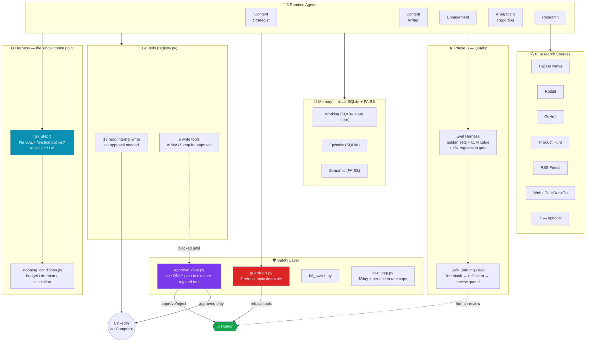
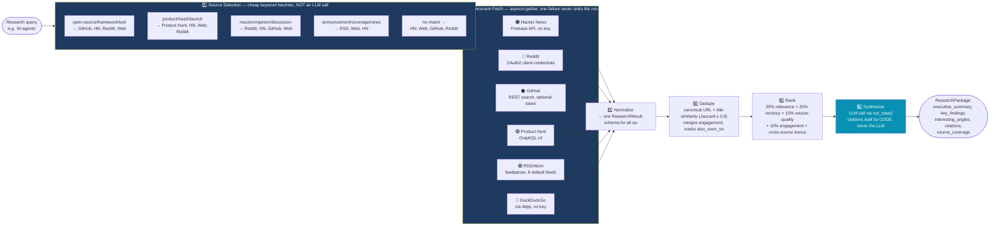
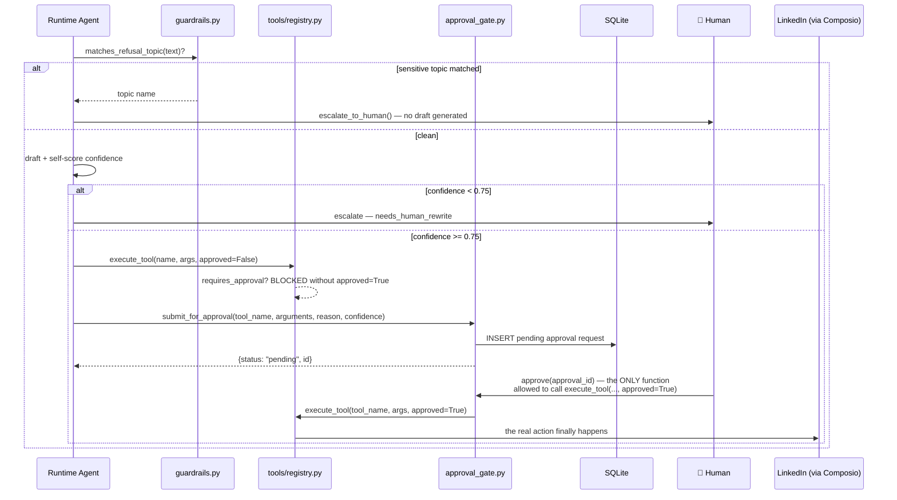
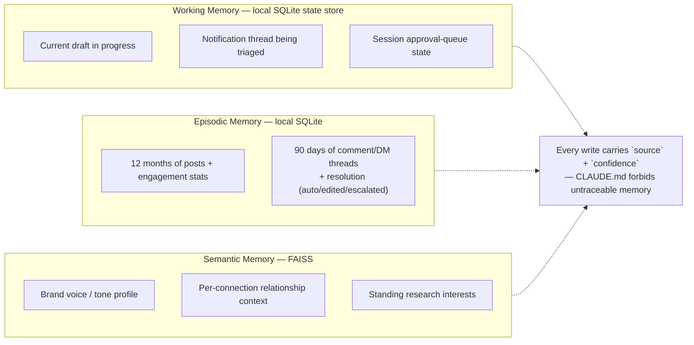
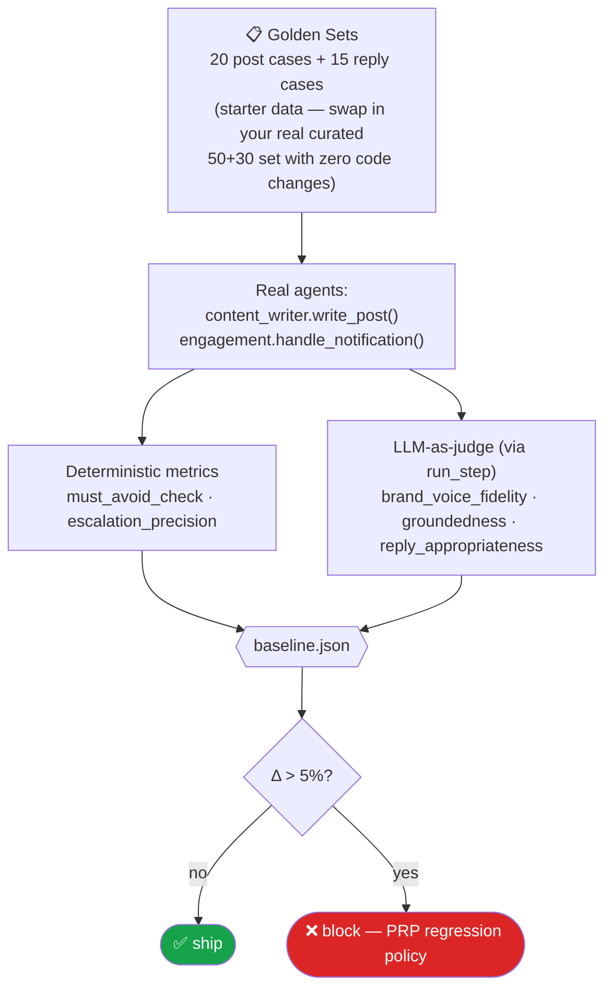
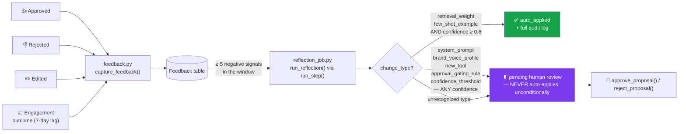
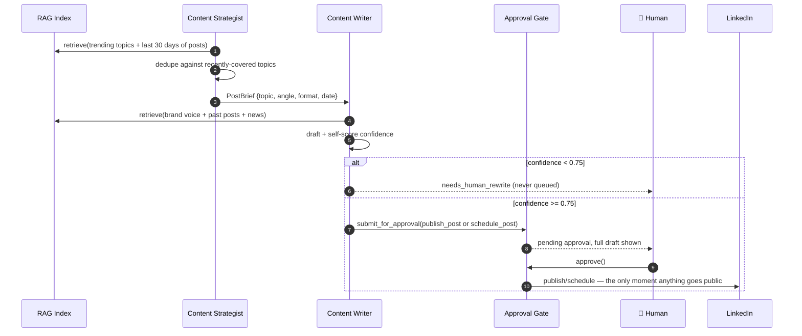
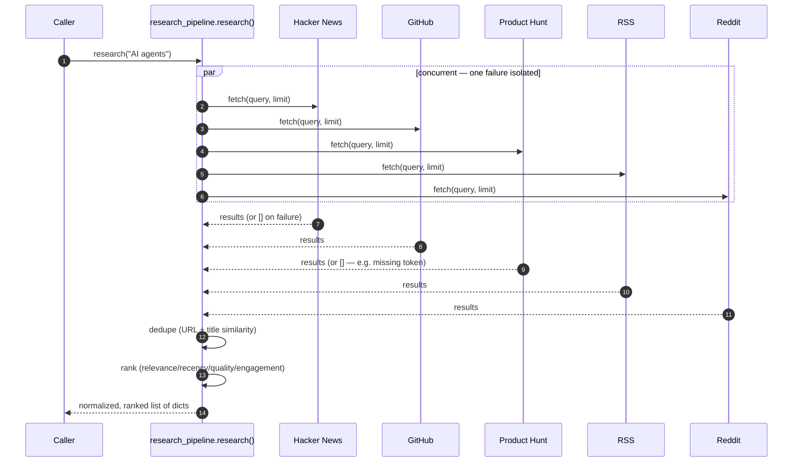
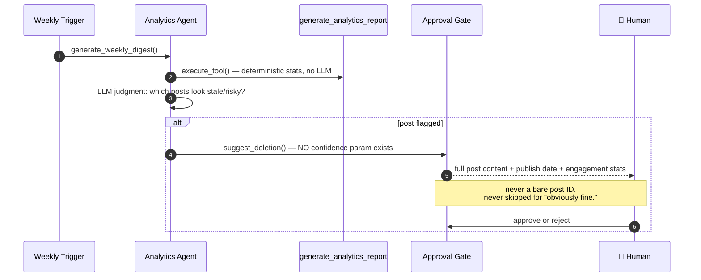
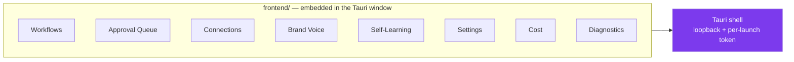

# 🤖 AI LinkedIn Manager

> A multi-agent system that manages a professional's LinkedIn presence end-to-end — drafting on-brand posts, engaging with the feed, replying to comments and DMs, tracking connections, reporting on performance, and researching AI/agentic-AI developments across six independent sources — with every public, irreversible, or third-party-contacting action gated behind explicit human approval. No exceptions, verified by test.

Free and open source (MIT). A **desktop app** — runs on your own computer, with your own credentials, in your own OS's secure credential store. Nobody's server, nobody's API keys, nobody's data but yours.

<p align="center">
  <em>5 runtime agents · 19 tools (6 require human approval) · 6 research sources · 581 tests</em>
</p>

---

## Table of Contents

1. [What This Actually Is](#what-this-actually-is)
2. [Install](#install)
3. [Design Philosophy](#design-philosophy)
4. [System Architecture](#system-architecture)
5. [The 5 Runtime Agents](#the-5-runtime-agents)
6. [The Multi-Source Research System](#the-multi-source-research-system)
7. [Safety & the Human-Approval Gate](#safety--the-human-approval-gate)
8. [Tool Registry](#tool-registry)
9. [Memory Architecture](#memory-architecture)
10. [RAG Pipeline](#rag-pipeline)
11. [Eval Harness](#eval-harness)
12. [Self-Learning Loop](#self-learning-loop)
13. [End-to-End Workflows](#end-to-end-workflows)
14. [A Note on "Animations"](#a-note-on-animations)
15. [Tech Stack](#tech-stack)
16. [Project Structure](#project-structure)
17. [Model Routing & Cost Controls](#model-routing--cost-controls)
18. [Development](#development)
19. [Dashboard (Frontend)](#dashboard-frontend)
20. [Testing & Validation Gates](#testing--validation-gates)
21. [Project Status](#project-status)
22. [Roadmap](#roadmap)
23. [How This Was Built](#how-this-was-built)
24. [Contributing](#contributing)
25. [License](#license)

---

## What This Actually Is

This is **not** a chatbot wrapper. It's a small society of narrowly-scoped agents, each with one job, a fixed toolset, and a hard-coded escalation rule, coordinated through a single choke-point agent loop, running entirely on your own machine. Nothing in this system can post, delete, message, or connect on a real person's behalf without a human explicitly clicking "approve" on the exact content that would go out.

Concretely, it:

- **Decides what to post about** by grounding topic selection in retrieved research, brand voice, and the last 30 days of published posts (Content Strategist)
- **Writes full post drafts** in the user's brand voice, self-scores its own confidence, and either queues the draft for approval or flags it "needs human rewrite" (Content Writer)
- **Monitors comments, DMs, and connection requests**, drafts replies, and screens every one for five categories of sensitive topics before it ever reaches a draft (Engagement)
- **Produces a weekly performance digest** and flags stale/underperforming/risky posts for possible deletion — a suggestion that *always* routes to a human, regardless of how confident the system is (Analytics & Reporting)
- **Tracks what's happening in AI** across Hacker News, Reddit, GitHub, Product Hunt, RSS feeds, and the general web (X/Twitter optional, off by default) to keep the Content Strategist's topic choices current (Research)

Every one of those five agents shares one rule without exception: **no agent holds a reference to an LLM client and calls it directly.** Every single model call in this entire codebase goes through one function — `harness.loop.run_step()` — which is what makes tracing, cost tracking, retries, and tool-call logging actually enforceable rather than aspirational.

---

## Install

### Option A — one-line install (Linux)

```bash
curl -fsSL https://raw.githubusercontent.com/codaswin/ALM_opensourse/main/install.sh | bash
```

Downloads the latest release and installs it with your system's package manager (`.deb` via `apt`, `.rpm` via `dnf`, or a standalone `.AppImage` as a fallback) — no cloning, no build tools, nothing else required. Read the script before piping it to `bash` if you'd rather not blindly trust a curl-pipe: [`install.sh`](install.sh).

This is an early, **unsigned** build — there's no Apple/Microsoft code-signing certificate behind it (those cost money and aren't set up yet), and no signed auto-update mechanism, so the app won't self-update; check the [Releases page](https://github.com/codaswin/ALM_opensourse/releases) for new versions. Windows and macOS installers aren't published yet — see Option B below to build for those platforms yourself in the meantime.

### Option B — build from source (all platforms)

1. **Clone the repository**

   ```bash
   git clone https://github.com/codaswin/ALM_opensourse.git
   cd ALM_opensourse
   ```

2. **Install the Python backend dependencies**

   ```bash
   python3 -m venv .venv
   . .venv/bin/activate
   pip install -r backend/requirements.txt
   ```

3. **Install the frontend dependencies**

   ```bash
   cd frontend
   npm install
   cd ..
   ```

4. **Install the native desktop prerequisites** (Rust from [rustup.rs](https://rustup.rs/), plus your OS's Tauri toolkit — Linux needs the WebKitGTK/GTK dev packages, Windows needs Visual Studio Build Tools and the WebView2 SDK, macOS needs Xcode Command Line Tools). Full per-OS list: [`docs/desktop-development.md`](docs/desktop-development.md).

5. **Build the frozen Python sidecar**

   ```bash
   bash scripts/build-sidecar.sh
   ```

6. **Build the installer**

   ```bash
   npx @tauri-apps/cli@2 build
   # or, if you'd rather install the CLI once: cargo install tauri-cli && cargo tauri build
   ```

7. **Install and launch it.** The finished installer is under `src-tauri/target/release/bundle/` — a `.AppImage`/`.deb`/`.rpm` on Linux, or the equivalent `.msi`/`.exe`/`.dmg`/`.app` once built on a Windows or macOS machine. First launch walks you through a short local onboarding, then you paste in your own Anthropic/OpenAI and Composio (LinkedIn) credentials on the Connections page — nothing is pre-filled, nothing is shared with anyone else's installation.

Full architecture: [`docs/architecture.md`](docs/architecture.md); security model: [`docs/security-model.md`](docs/security-model.md); data ownership/storage: [`docs/data-boundaries.md`](docs/data-boundaries.md).

---

## Design Philosophy

Five decisions shape everything else in this repo:

**1. Approval is structural, not a suggestion.** `requires_approval=True` on a tool isn't a flag some code path checks when convenient — `tools/registry.execute_tool()` refuses to run a gated tool without an explicit `approved=True`, and there is exactly **one function in the entire codebase** permitted to flip that flag: `safety.approval_gate.approve()`. A static audit (`python -m app.safety.audit`) fails the build if that ever stops being true.

**2. Cost-consciousness is a first-class design constraint, not an afterthought.** The Research Agent was originally X (Twitter)-only. X's API got expensive, so it was refactored into six sources — five of which need no paid API key at all (Hacker News, RSS, and DuckDuckGo web search need *nothing*; GitHub and Product Hunt work at generous free tiers). X is still available, just opt-in.

**3. Self-improvement is reviewed, never silent.** The learning loop can auto-apply a retrieval-weight tweak or an additive few-shot example on its own. It can **never** auto-apply a change to a system prompt, the brand-voice profile, a new tool, an approval-gating rule, or a confidence threshold — regardless of how confident the reflection job's own analysis is. That's enforced in code (`proposal_review.submit_proposal()`), not just policy.

**4. Every agent is testable without a live model — even now that a live one exists.** Every agent function takes an injectable `llm_client`, and every one of this repo's tests still runs against a fake; the one real implementation (`model_router.route_and_call`, wired to Anthropic or OpenAI for primary/cheap and Hermes/vLLM for the worker tier) is itself just another value that fits the same `llm_client` slot. That was a deliberate sequencing choice: build and prove the harness, the safety gates, and the eval/learning infrastructure first — against fakes — and only then wire in a real model, so "real" never means "suddenly untestable."

**5. Your credentials are yours, structurally, not by convention.** Every LinkedIn/AI-provider/research-source credential belongs to your installation alone — never a shared or process-wide value. `resolve_credential()` has no fallback: a value only exists if you saved it yourself, through the Connections page, into your own OS's secure credential store (`app/tenancy/`, `app/credential_store.py`).

---

## System Architecture



The shape to internalize: **every arrow that touches LinkedIn or a real third party passes through the purple approval gate first.** There is no other path.

---

## The 5 Runtime Agents

| # | Agent | Model Tier | Tools It Can Call | Escalation Condition |
|---|-------|-----------|--------------------|-----------------------|
| 1 | **Content Strategist** | Cheap (planning task) | `search_knowledge_base` | None — output is an internal brief, never user-facing |
| 2 | **Content Writer** | Primary | `search_knowledge_base`, `draft_post` | Brand-voice confidence < **0.75** → `needs_human_rewrite`, never queued |
| 3 | **Engagement** | Worker (triage) / Primary (draft) | `get_linkedin_notifications`, `search_knowledge_base`, `like_post`, `reply_to_comment`, `reply_to_dm`, `send_connection_request` | Sensitive-topic match **or** confidence < 0.75 → escalate, no draft produced |
| 4 | **Analytics & Reporting** | Cheap (digest) | `generate_analytics_report`, `search_knowledge_base`, `delete_post` | `delete_post` suggestions **always** escalate, unconditionally |
| 5 | **Research** | Worker (triage) / Primary (digest, synthesis) | 6 source tools + `save_research_note`, `search_knowledge_base` | None — read-only, informational only |

### 1. Content Strategist Agent

Decides **what** to post about, never writes a word of copy. Pulls the content calendar, RAG-retrieved trending topics (including the Research Agent's findings), and the last 30 days of published posts; de-duplicates against recently-covered topics using a keyword-overlap heuristic (falls back to the full retrieved set if *everything* overlaps, rather than handing the next agent nothing). Output is one structured `PostBrief`: `{topic, angle, format, target_publish_date}`.

### 2. Content Writer Agent

Turns a `PostBrief` into full post copy, grounded in the brand-voice/style-guide RAG source, past posts, and industry news — then **self-scores its own confidence** that the draft matches brand voice. There is no partial credit: `confidence >= 0.75` → submitted to the human approval queue with either `publish_post` or `schedule_post` (chosen automatically based on whether the brief carries a `target_publish_date`); below that → returned as `needs_human_rewrite`, never touching the approval queue at all.

### 3. Engagement Agent

Watches comments, DMs, and connection requests. For every notification, the **first** check — before any drafting happens — is a regex-based refusal-topic scan (`guardrails.matches_refusal_topic`) across five categories: political endorsements, health/financial/legal advice, disparagement of a named individual or competitor, engagement-bait/misinformation, and impersonation requests. A match means immediate escalation with zero draft generated. If clean, it drafts a reply grounded in past comment/DM threads and brand voice, scores confidence, and either escalates (< 0.75) or queues for approval. `like_post` is the one action in this agent's toolkit that executes directly — it's rate-capped and reversible, not identity-risking.

### 4. Analytics & Reporting Agent

Produces a weekly digest (impressions, engagement rate, follower delta — all deterministic, pulled straight from stored data, never re-derived by the LLM) and uses the model only for the judgment call: which posts look underperforming, stale, or reputationally risky enough to flag. `suggest_deletion()` has **no confidence parameter at all** — there's no code path by which a "the model is very sure" argument could ever skip the approval queue for a delete action, and the approval prompt is required to carry the full post content, publish date, and engagement stats (never a bare post ID).

### 5. Research Agent

The most heavily reworked piece of this system — see the next section.

---

## The Multi-Source Research System

**Origin story:** this agent started as an X (Twitter)-only research feed. X's API is expensive at any real volume, so it was refactored into a modular, six-source system where X is available but never the default.



### The 6 sources

| Source | Auth | Cost | What it's good for |
|--------|------|------|---------------------|
| **Hacker News** | None | Free | Top/new/best/show/ask/job stories, optional top-comment context |
| **Reddit** | OAuth2 client-credentials | Free | Subreddit-aware search with keyword-based subreddit inference (AI → r/LocalLLaMA, r/MachineLearning; startups → r/startups, r/SaaS; falls back to sitewide search) |
| **GitHub** | Optional token (works unauthenticated) | Free | Repository discovery — stars, forks, language, topics, recent activity |
| **Product Hunt** | GraphQL v2 token | Free | Recently-launched products, filtered client-side by keyword since PH's API has no free-text search |
| **RSS/Atom** | None | Free | 8 built-in feeds (TechCrunch, VentureBeat, HN Best/Newest, Y Combinator, MIT Tech Review, Google AI Blog, Hugging Face) — fully overridable via `RSS_FEEDS` |
| **Web (DuckDuckGo)** | None | Free | General web search via the `ddgs` package — zero configuration |
| **X (Twitter)** | Composio, read-only | Paid API | **Optional only** — never chosen by the selection heuristic, reachable only via explicit `sources=["x", ...]` |

### Every source is isolated from every other

```python
async def _fetch_source(source: str, query: str, limit: int) -> list[ResearchResult]:
    adapter = ALL_SOURCES[source]
    try:
        return await adapter(query, limit)
    except Exception as exc:
        logger.warning("research_source_adapter_failed", source=source, error=str(exc))
        return []   # one dead source degrades gracefully — never sinks the run
```

Reddit's credentials aren't configured yet in most fresh setups? No problem — that source silently returns `[]`, gets logged, and the other five keep working. This was proven in production use during development: Product Hunt and web-search feeds both hit real transient failures (missing tokens, HTTP redirects) during testing, and neither ever took down a research run.

### Ranking is never "sort by popularity"

```python
score = (0.35 * relevance) + (0.25 * recency) + (0.15 * source_quality) + (0.10 * engagement) + cross_source_bonus
```

A viral-but-irrelevant Reddit thread loses to a quiet, on-topic RSS announcement from an official blog — relevance, recency, and source trust deliberately outweigh raw engagement 9-to-1.

---

## Safety & the Human-Approval Gate



### The five refusal topics (regex-matched, `guardrails.py`)

| Topic | Example trigger |
|-------|------------------|
| Political endorsement | *"who should I vote for..."* |
| Health/financial/legal advice | *"what medication should I take"*, *"should I invest in..."* |
| Disparagement | *"bash our competitor"*, *"worst CEO"* |
| Engagement-bait / misinformation | *"comment yes if..."*, *"unverified claim"* |
| Impersonation | *"pretend to be..."*, *"ghostwrite this as..."* |

### Rate & cost caps

| Cap | Default | Enforced by |
|-----|---------|-------------|
| LLM spend | $10/day | `llmops/cost_tracker.py` |
| Posts | 3/day | `LINKEDIN_API_RATE_LIMIT_POSTS_DAILY` |
| Deletes | 3/day | `LINKEDIN_API_RATE_LIMIT_DELETES_DAILY` |
| Comment/DM replies | 20/day | `LINKEDIN_API_RATE_LIMIT_REPLIES_DAILY` |
| Connection requests | 5/day | `LINKEDIN_API_RATE_LIMIT_CONNECTIONS_DAILY` |
| Likes | 20/day | `LINKEDIN_API_RATE_LIMIT_LIKES_DAILY` |

Plus a kill switch (`safety/kill_switch.py`) that `approve()` checks before executing anything — flip it (from the Settings page) and every pending approval refuses to execute until it's cleared.

A static audit enforces all of this stays true: `python -m app.safety.audit` walks the full tool registry and fails loud if it ever finds a risky tool without a gate.

---

## Tool Registry

19 tools total, 6 requiring human approval:

| Tool | Approval? | Purpose |
|------|:---:|---------|
| `search_knowledge_base` | — | Query the RAG index |
| `get_linkedin_notifications` | — | Poll comments/DMs/connection requests (read-only) |
| `draft_post` | — | Create a queued (unpublished) draft |
| `generate_analytics_report` | — | Summarize stored engagement data |
| `like_post` | — | Like a post (rate-capped, logged, not identity-risking) |
| `search_hackernews` | — | Hacker News research source |
| `search_reddit` | — | Reddit research source |
| `search_github` | — | GitHub research source |
| `search_producthunt` | — | Product Hunt research source |
| `search_rss` | — | RSS/Atom research source |
| `search_web` | — | Web search (DuckDuckGo by default) |
| `search_x_posts` | — | X research source (read-only, optional) |
| `save_research_note` | — | Persist a research finding (internal write only) |
| **`publish_post`** | ✅ | Publish to LinkedIn immediately |
| **`schedule_post`** | ✅ | Queue a future publish |
| **`delete_post`** | ✅ | Delete a published post — irreversible |
| **`reply_to_comment`** | ✅ | Public reply, attributed to the user |
| **`reply_to_dm`** | ✅ | Private message to a real third party |
| **`send_connection_request`** | ✅ | Connection request — ToS-sensitive |

Every tool has a Pydantic input schema and every call is sandboxed with a timeout. Harness-managed calls retain full input/output/latency/cost records, while direct registry executions emit structured status and latency logs.

---

## Memory Architecture



Retention: episodic post/engagement data kept 12 months then archived; DM/comment thread **content** (not metadata) purged after 90 days unless the user flags it important — LinkedIn ToS and privacy-driven, not arbitrary.

---

## RAG Pipeline

| Source | Type | Update Frequency | Chunking |
|--------|------|-------------------|----------|
| Past LinkedIn posts | Structured | On publish | 1 chunk/post |
| Brand voice / style guide | Document | Static | 500 tokens, semantic split |
| Industry news / trending topics | Document | Daily | 1 chunk/article |
| Comment/DM threads | Q&A pairs | Continuous | 1 chunk/thread |
| Research notes (multi-source) | Structured | Per research run | 1 chunk/note, deduped |

Your installation gets its own isolated FAISS-backed `VectorStore`, stored locally in your app-data directory. Ingestion is idempotent by `(source_type, source_id)` — re-ingesting an edited document evicts its old chunks before adding fresh ones, so the index never silently accumulates duplicates.

---

## Eval Harness



- **`must_avoid_check`** — deterministic phrase-ban check against `must_avoid` fields declared right in the golden set
- **`escalation_precision`** — recall (did it escalate when it should?) and precision (did it over-escalate?) computed purely from expected vs. actual behavior, no judge needed
- **LLM judge** — scores brand-voice fidelity and groundedness 1-5, bias-aware (no length bias, no position bias — one candidate scored at a time against fixed written criteria)
- **First run establishes the baseline** rather than failing outright — there's nothing to regress against yet
- 15 of the 15 reply cases are independently cross-checked against the *real* `guardrails.matches_refusal_topic()` regex, not just trusted to LLM judgment — a dedicated test enforces this stays true

Run it: `pytest backend/evals -v --tb=short`

---

## Self-Learning Loop



The hard line, verified by a parametrized test at **confidence = 1.0**: a `system_prompt` or `safety_threshold` proposal never auto-applies, no matter how sure the reflection job's own analysis claims to be. That's exactly the case a self-modifying system must never trust itself on.

| What can auto-apply | What always needs a human |
|---|---|
| Retrieval ranking weight tweaks | System prompt changes |
| Additive few-shot examples | Brand-voice profile changes |
| *(only at ≥ 0.8 confidence)* | New tools |
| | Approval-gating rule changes |
| | Confidence threshold changes |

---

## End-to-End Workflows

### Post creation, from idea to LinkedIn



### Multi-source research, in one call



### Weekly digest → delete suggestion (never auto-executed)



---

## A Note on "Animations"

Being upfront: a plain `README.md` rendered on GitHub can't run real animation — no JS, no CSS transitions, no live motion. What it *can* do natively is render [Mermaid](https://mermaid.js.org/) diagrams, which is why this document leans on them heavily above rather than static ASCII art or (worse) a fabricated animated GIF I have no way to actually produce or verify renders correctly. Every diagram in this README is real, valid Mermaid syntax that GitHub will render as an interactive-feeling SVG in the actual repo view. If you want true animation (a recorded terminal session of the eval suite running, a GIF of the approval-queue UI once one exists), that's a good candidate for a `/docs/media` folder with real captured assets — nothing here should be treated as a placeholder for that.

---

## Tech Stack

| Layer | Choice | Why |
|-------|--------|-----|
| Orchestration | Custom typed Python harness with specialized agents | Keeps the agent boundaries, tracing, budgets, and approval contracts explicit |
| Inference (primary) | Anthropic Claude or OpenAI (your own key, either provider) | Hosted, strong generation quality |
| Inference (worker) | Hermes via vLLM (self-hosted, optional) | Cheap/fast for high-volume triage |
| RAG | FAISS, one isolated index per installation | No KG layer for MVP |
| Serving | FastAPI (`app/main.py`), run as a local sidecar process | Settings, approval queue, learning queue, cost, health, diagnostics |
| Desktop shell | [Tauri 2](https://tauri.app/) (Rust) + React UI | Owns the frozen Python sidecar's lifecycle, loopback auth, native window — no Electron/Node/Chromium runtime |
| Backend packaging | PyInstaller (frozen sidecar binary, one per OS) | You never install Python yourself |
| Frontend | React + Vite + TypeScript (`frontend/`) | Runs embedded inside the Tauri window |
| Scheduling | APScheduler | Reflection, research, engagement, retention, and approved publishing jobs — runs while the app is open |
| Database | SQLite (WAL mode) | Local, no setup, no server process to install |
| Runtime state / locks | SQLite | Working memory, rate/cost counters, kill switch, scheduler locks |
| Credential storage | Your OS's native keyring (Windows Credential Manager / macOS Keychain / Linux Secret Service) | Never plaintext, never in the frontend bundle |
| LinkedIn integration | Composio | Auth, token refresh, low-level rate limits offloaded |
| X integration | Composio, read-only scope | Optional research source only |
| Web search | `ddgs` (DuckDuckGo) | No API key, swappable via `WebSearchProvider` interface |
| RSS parsing | `feedparser` | Handles RSS 2.0 / Atom / RDF dialect variance |
| Testing | pytest + pytest-asyncio + pytest-cov | 581 tests |

---

## Project Structure

```
backend/
├── app/
│   ├── main.py                # FastAPI app — settings/approvals/learning-queue/cost/health/diagnostics/backup
│   ├── agents/                 # The 5 runtime agents + research_pipeline/sources/schema
│   ├── harness/                 # run_step() — the sole LLM choke point, state machine, stopping conditions
│   ├── tools/                  # 19 registered tools + sandbox + rate limiting + Composio client + connection_test.py
│   ├── memory/                 # working / episodic / semantic stores + platform_credentials.py
│   ├── rag/                    # ingestion + retrieval (installation-isolated FAISS, cross-platform locking)
│   ├── context/                 # token-budget assembly + compaction
│   ├── safety/                  # guardrails, approval gate, kill switch, cost cap, audit CLI
│   ├── llmops/                   # model router (+ live route_and_call), anthropic/openai/hermes clients, tracer
│   ├── learning/                  # feedback capture, reflection job, proposal review queue, scheduler
│   ├── tenancy/                    # per-job context, per-installation credential overlay, RAG paths
│   ├── runtime.py                   # the immutable desktop runtime capability profile
│   ├── application_paths.py          # desktop app-data directory layout
│   ├── credential_store.py            # OS-keyring adapter — never plaintext
│   ├── backup.py                       # backup create/list (SQLite + RAG snapshot)
│   └── models/                          # SQLAlchemy models (approvals, feedback, proposals, settings, episodes)
├── evals/                    # golden sets, metrics, LLM judge, regression-gate runner
└── tests/                    # unit and integration tests for everything above

frontend/
├── src/
│   ├── api.ts                # typed fetch client for every backend endpoint
│   ├── types.ts               # response shapes, mirrors backend/app/main.py exactly
│   └── views/                   # workflows, approvals, connections, brand voice, learning,
│                                 # settings, cost, diagnostics
└── README.md                 # frontend-specific setup/build docs

src-tauri/
├── src/lib.rs                # spawns the sidecar, per-launch token, process-group cleanup on exit
├── tauri.conf.json           # bundle config, icons, window, CSP
├── icons/                    # native app icons (all platforms)
└── binaries/                 # frozen per-OS sidecar, built by scripts/build-sidecar.sh (git-ignored)

docs/
├── architecture.md, security-model.md, data-boundaries.md   # current-state design docs
├── desktop-development.md, packaging.md, releasing.md        # build/release instructions
└── desktop-migration-audit.md, desktop-implementation-status.md   # how the desktop shell got here
```

---

## Model Routing & Cost Controls

Every `(agent, step)` pair resolves to exactly one tier — never hardcoded elsewhere, always through `llmops/model_router.route()`:

| Agent | Step | Tier | Why |
|-------|------|:---:|-----|
| Content Strategist | plan | Cheap | Planning/routing, not generation |
| Content Writer | draft | **Primary** | Generation quality matters |
| Engagement | triage | Worker | High-volume, low-stakes |
| Engagement | draft | **Primary** | Reply quality matters |
| Analytics | summarize | Cheap | Digest summarization |
| Research | triage | Worker | High-volume post filtering |
| Research | digest | **Primary** | Final write-up quality |
| Research | synthesize | **Primary** | Multi-source synthesis |
| Evals | judge | **Primary** | Gates ship/no-ship decisions |
| Learning | reflect | **Primary** | Infrequent, high-stakes proposals |

---

## Development

```bash
git clone https://github.com/codaswin/ALM_opensourse.git
cd ALM_opensourse

python3 -m venv .venv && . .venv/bin/activate
pip install -r backend/requirements.txt
cd frontend && npm install && cd ..

# run the full test suite (no live credentials needed — everything runs on fakes)
python -m pytest backend/tests backend/evals -v
ruff check backend
mypy backend/app --ignore-missing-imports
PYTHONPATH=backend python -m app.tools.registry --validate-all-schemas
PYTHONPATH=backend python -m app.safety.audit

# run the desktop shell in dev mode (hot-reloading React + a live sidecar)
bash scripts/build-sidecar.sh
npx @tauri-apps/cli@2 dev   # or: cargo install tauri-cli, then `cargo tauri dev`
```

To produce an actual installer instead of a dev session, see [Install](#install) and [`docs/packaging.md`](docs/packaging.md). Full native-prerequisite list per OS: [`docs/desktop-development.md`](docs/desktop-development.md).

---

## Dashboard (Frontend)

A React + Vite + TypeScript single-page app (`frontend/`) — no component framework, no state-management library, no router; `useState` per view is enough for a review-and-decide tool. It runs embedded inside the Tauri desktop window; the Tauri shell authenticates the webview to its own local backend sidecar directly (loopback binding + a per-launch token) — there's no session cookie, no login screen, nothing reachable from outside your machine.



| View | Backend resource | What you can do |
|------|-------------------|-------------------|
| **Workflows** | `/workflows/*` | Manually trigger research, content, analytics, and engagement runs |
| **Approval Queue** | `/approvals/*` | See every pending gated action with full argument content shown (never a bare post ID) — approve, reject, or retry |
| **Connections** | `/credentials/*`, `/credentials/{id}/test` | Save API keys/tokens/connected-account IDs into your OS's secure keyring, then actually test them against the real provider — `connected` / `invalid` / `missing` / `unavailable`, not just "a value is stored" |
| **Brand Voice** | `/brand-voice/*` | Maintain titled brand-voice profiles that are also ingested into RAG |
| **Self-Learning** | `/learning/proposals/*`, `/learning/reflect` | Review reflection-job proposals (flagged clearly when a type can never auto-apply), trigger an on-demand reflection run |
| **Settings** | `/settings/{key}`, `/system/pause`, `/system/resume` | View/edit agent settings, and the kill switch — pause every approved external action |
| **Cost** | `/cost` | Today's LLM spend vs. the daily cap, as a progress bar |
| **Diagnostics** | `/diagnostics`, `/backup` | Live health of the database, runtime-state store, scheduler, vector store, and credential store — plus one-click workspace backups |

Full setup/build details: `frontend/README.md`.

---

## Testing & Validation Gates

```bash
# Gate 1 — foundation
pytest backend/tests/test_harness.py backend/tests/test_memory.py backend/tests/test_rag.py -v
python -m app.safety.audit

# Gate 2 — tools + safety
pytest backend/tests/test_tools.py backend/tests/test_safety.py -v

# Gate 3 — quality
pytest backend/evals -v --tb=short
python -m backend.evals.run_evals --compare-to-baseline

# Final gate
ruff check backend
mypy backend/app --ignore-missing-imports
pytest backend/tests backend/evals --cov=backend/app --cov=backend/evals --cov-fail-under=80
PYTHONPATH=backend python -m app.tools.registry --validate-all-schemas
PYTHONPATH=backend python -m app.safety.audit
cd frontend && npm run lint && npm run build

# Desktop shell (needs Rust + your OS's Tauri prerequisites — docs/desktop-development.md)
python scripts/check-version.py
bash scripts/build-sidecar.sh
cd src-tauri && cargo check
```

Current state: **581 tests passing**, ruff/mypy clean, frontend lint/build clean, tool-registry audit green, safety audit green. `.github/workflows/ci.yml` runs the backend and frontend gates above on every push/PR, plus a `desktop` job that compiles the Tauri shell natively on Ubuntu, Windows, and macOS runners.

---

## Project Status

Honest state, not aspirational: **version 0.2.0 has real, downloadable Linux installers — still unsigned, and Windows/macOS aren't published yet.**

What's real and tested today:

- Every agent, safety gate, tool, eval, and the self-learning loop — all of it.
- On Linux: `.deb`/`.rpm`/`.AppImage` are built and published automatically via `.github/workflows/release.yml` whenever a version tag is pushed, and the one-line installer above downloads and installs the right one for your system. Smoke-tested — launches without any manually-installed Python/PostgreSQL/Redis, migrates its own SQLite database, authenticates its loopback API, and shuts down its sidecar cleanly with no orphan process (a real bug found and fixed this way: the frozen sidecar's own child process used to survive after the app closed).
- This repository is desktop-only: the self-hosted/multi-user dashboard login (password auth, cookie sessions, CSRF, admin user-invite) and the Docker/VPS deployment infrastructure that used to live here have been removed — self-hosted deployment is maintained in a separate repository now. A non-desktop request against this codebase gets a clean `501`, not a half-working login screen.

What's not done yet:

- **Windows and macOS installers** haven't been built and published — only compiled (`cargo check`) on GitHub-hosted CI runners so far. There's no guarantee a packaged build behaves identically there until real installers are built and smoke-tested.
- **No code-signing, notarization, or auto-update mechanism** exists yet — the published installers are unsigned, and the app won't self-update. That's a deliberate choice: shipping a real, secure signing/update pipeline is real infrastructure work, not something to fake. Check the [Releases page](https://github.com/codaswin/ALM_opensourse/releases) for new versions manually in the meantime.

See [`docs/desktop-implementation-status.md`](docs/desktop-implementation-status.md) for the detailed, continuously-updated list of what's verified vs. still open, and [`docs/desktop-migration-audit.md`](docs/desktop-migration-audit.md) for how the desktop shell was designed.

---

## Roadmap

**Done (this repo, right now):**
- [x] All 5 runtime agents, brand-voice/confidence-gated drafts
- [x] Human-approval flow blocking all 6 `requires_approval` tools, no bypass
- [x] Refusal-topic escalation across 5 categories
- [x] Multi-source Research Agent (6 sources, X optional)
- [x] Eval harness with regression gate
- [x] Self-learning loop with hard human-review lines
- [x] Production automation for research, engagement polling, retention, and approved scheduled publishing
- [x] Episodic analytics aggregation with real impressions, engagement, follower, and top-post metrics
- [x] FastAPI serving layer (`main.py`) — settings, approval queue, learning-proposal queue, cost, health, diagnostics, backup, all over the same tested infrastructure above
- [x] Self-learning loop running on an actual schedule (`learning/scheduler.py`, APScheduler, weekly by default, wired into the app's startup lifespan)
- [x] A real live LLM client (`model_router.route_and_call`) — Anthropic or OpenAI for primary/cheap tiers, Hermes/vLLM (OpenAI-compatible) for the worker tier, both via a forced structured tool-call so every existing agent's response-parsing contract is untouched
- [x] Dashboard UI for workflows, connections, brand voice, approval queue, self-learning queue, agent settings, cost, and diagnostics (`frontend/`, React + Vite)
- [x] Desktop runtime — Tauri shell, frozen Python sidecar, SQLite + OS keyring, no login, no PostgreSQL/Redis dependency
- [x] Live-tested provider connectivity checks (`POST /credentials/{id}/test`) and a Diagnostics view for every backing service
- [x] Production hardening: OS keyring credential storage, Alembic-first startup with pre-migration backup, durable lock-protected FAISS snapshots, CI (backend + frontend + native desktop compile matrix), and centralized Python tooling config
- [x] A GitHub Releases page with downloadable Linux artifacts, published automatically by `.github/workflows/release.yml` on every version tag, plus a one-line installer script
- [x] Desktop-only cleanup — the self-hosted/multi-user dashboard login and Docker/VPS deployment infrastructure have been fully removed from this repository

**In progress / explicitly not done:**
- [ ] Signed Windows and macOS installers, built and smoke-tested on native machines
- [ ] Code signing, notarization, and an auto-updater

**Explicitly post-MVP (per the original spec):**
- [ ] Connection-relationship knowledge graph
- [ ] Analytics-driven auto-scheduling

**Known limitations carried into the live client:** `RouteAndCallResponse.tool_calls` is always `[]` — no runtime agent built in this codebase ever passes a non-`None` `tool_executor` to `run_step()` (agents call `tools.registry.execute_tool()` directly outside the harness loop), so harness-native tool execution/logging remains future work. Anthropic/OpenAI pricing in `.env.example` is placeholder defaults, not verified real per-token pricing — override before trusting the cost cap for anything real.

---

## How This Was Built

This system was built PRP-style: a detailed spec (`INITIAL.md`) generated a full implementation blueprint, executed in phases with validation gates between each:

```
Phase 1 (Foundation) → Phase 2 (5 runtime agents + safety) → Phase 3 (evals + self-learning)
  → Phase 4 (FastAPI serving layer + scheduled learning loop) → Phase 5 (live LLM client)
  → Phase 6 (per-installation credential architecture) → Phase 7 (desktop migration)
```

Each phase's validation gate had to pass before the next started. Every non-trivial design decision in this codebase — why X is optional, why deletion has no confidence bypass, why `system_prompt` changes can never auto-apply, why the desktop shell is Tauri instead of Electron — traces back to an explicit requirement in that phase's spec, not an implementation afterthought. The desktop migration specifically followed `desktopv.md`'s brief through a repository audit (`docs/desktop-migration-audit.md`) and a PRP (`docs/prp/desktop-production-migration.md`) before any runtime code changed.

---

## Contributing

Issues and pull requests are welcome. Before opening a PR:

1. Read [`CLAUDE.md`](CLAUDE.md) — the non-negotiable rules (approval gating, the LLM choke point, no silent context truncation, no capability without an eval) apply to human contributors exactly as much as to an AI agent working on this repo.
2. Run the [validation gates](#testing--validation-gates) relevant to what you changed before pushing.
3. If you touch anything under `backend/app/safety/`, `backend/app/tools/registry.py`, or approval-gating logic, run `python -m backend.app.safety.audit` explicitly and explain in the PR description why the change preserves every existing invariant.
4. New agent capabilities need a golden-set eval added under `backend/evals/` — a capability without one isn't considered done, per `CLAUDE.md`.

For desktop-shell changes specifically, see [`docs/desktop-development.md`](docs/desktop-development.md) for native prerequisites per OS, and [`docs/security-model.md`](docs/security-model.md) for the threat model any change there needs to preserve (loopback-only binding, per-launch token, no plaintext credential fallback).

---

## License

[MIT](LICENSE) — do whatever you want with this, including running your own fork against your own LinkedIn account and your own model provider. No attribution required, though it's appreciated.
