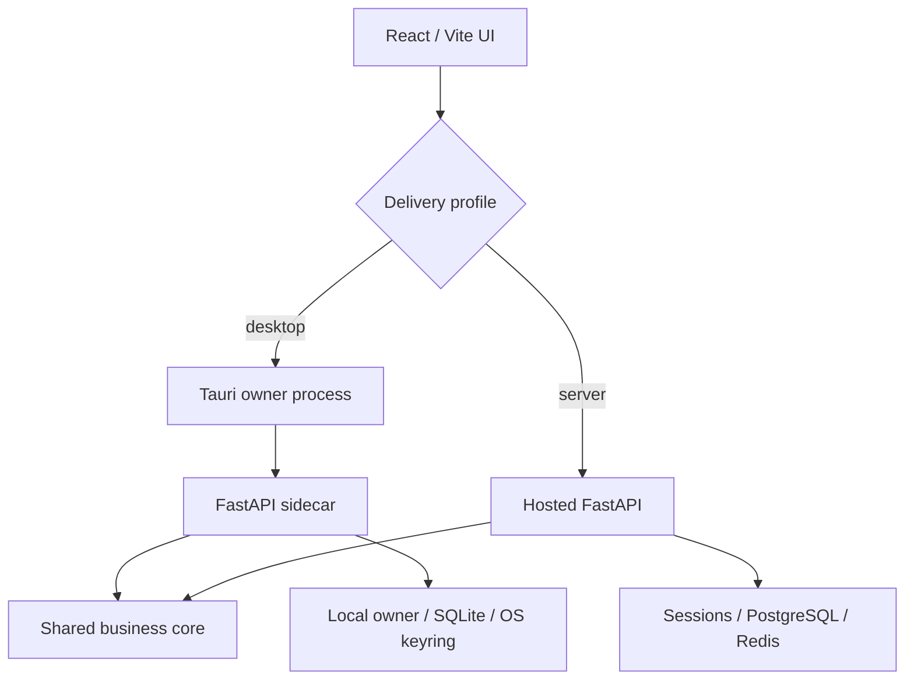

# Application Architecture

## Purpose

AI LinkedIn Manager has one business core and two delivery profiles. The hosted server and personal desktop application must share agent behavior and safety enforcement while using infrastructure appropriate to their deployment.

## Shared business core

The following components are runtime-independent:

- five agents and the custom `run_agent` / `run_step` harness;
- model router as the sole LLM call boundary;
- central tool registry and Pydantic input schemas;
- durable approval workflow for externally consequential tools;
- guardrails, confidence policy, kill switch, rate limits, and cost cap;
- learning, memory, evaluation, and observability semantics.

Runtime mode must never be accepted as a reason to bypass these components.

## Runtime profiles



`backend/app/runtime.py` is the initial immutable contract. Server is the default to preserve current behavior. Desktop mode requires an absolute application-data path supplied by the native owner.

## Dependency direction

Business services depend on contracts, not deployment implementations:

```text
API / scheduler
      |
application services
      |
agents -> model router -> providers
      |
tools -> approval gate -> external providers
      |
identity | repositories | state | credentials | paths
      |
server adapters OR desktop adapters
```

No adapter may call a gated tool directly. No frontend or shell command may set `approved=True`.

## Desktop lifecycle contract

1. Tauri obtains the OS application-data path and a single-instance lease.
2. Tauri creates a per-launch secret and starts the sidecar with a private pipe.
3. The sidecar validates configuration, backs up if necessary, and runs migrations.
4. The sidecar reports authenticated readiness on a loopback, OS-selected port.
5. Tauri loads the UI only after readiness.
6. On exit, Tauri requests graceful scheduler/database shutdown and enforces a bounded termination timeout.

Initial releases run scheduled jobs only while the application is open. Tray and launch-at-login behavior require a separate consented capability.

## Module evolution

Phase 2 introduces interfaces for identity, state, credentials, application paths, and scheduler coordination. Existing modules move behind those interfaces incrementally, with server adapters first preserving behavior and desktop adapters added under contract tests. Tauri scaffolding waits until these boundaries exist.
