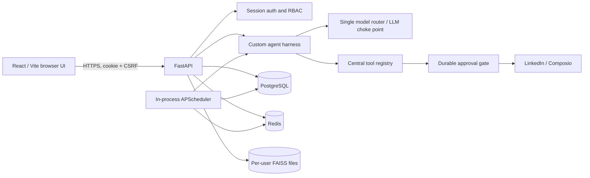
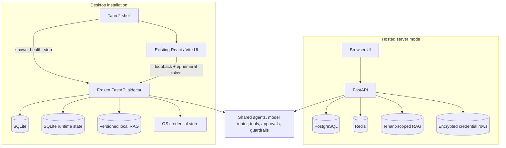

# Desktop Migration Audit

Status: Phase 0 complete; implementation is gated on review of this document  
Audit date: 2026-08-20  
Scope: repository, tracked documentation, runtime configuration, migrations, tests, and recent Git history

## Executive decision

The project can become a production desktop application without replacing its agent system. The recommended architecture is **Tauri 2 + the existing React/Vite frontend + a frozen Python/FastAPI sidecar**. Desktop mode should use SQLite and a durable local state adapter, while server mode should retain PostgreSQL, Redis, session authentication, and multi-user behavior.

This is not yet a packaging-only exercise. The current application assumes a continuously available web server, Redis, deployment-wide secrets, and Unix filesystem locks. Those assumptions must first be separated behind runtime, state, identity, credential, and path abstractions. The safety architecture must remain invariant throughout the migration.

No application code was changed during Phase 0. That is intentional: `desktopv.md` requires this audit to pass review before major implementation begins.

## Audit evidence and baseline

The audit covered 252 tracked files, the application entry points, all models and migrations, agent/tool/safety paths, scheduler jobs, frontend views and API client, deployment assets, CI, and recent history.

Validation performed against the current worktree:

| Check | Result |
|---|---|
| Backend and evaluation tests | 551 passed |
| Ruff | Passed |
| Mypy over `backend/app` | Passed (100 source files) |
| Tool schema validation | Passed (19 tools, 6 approval-gated) |
| Static safety audit | Passed |
| Frontend lint | Passed |
| Frontend production build | Passed |
| Full Alembic migration chain on clean SQLite | Passed through `20260819_0007` |

The README's reported test totals (497 and 510 in different places) are stale.

## 1. Current architecture



### Backend and orchestration

- FastAPI owns API routing, authentication middleware, lifecycle, and the in-process scheduler.
- Five runtime agents exist: content strategist, writer, engagement, analytics, and research.
- Agents use the repository's Pydantic-based `run_agent` / `run_step` harness. CrewAI is not installed or used.
- Every LLM step goes through the model router. This is the existing choke point for provider selection, cost control, observability, and policy enforcement.
- The registry contains 19 tools. Six require approval: publish, schedule, delete, reply to comment, reply to direct message, and connect.
- Some agents call tools directly outside the harness. Model-returned tool calls are not yet executed by the harness and are currently reported as empty.

### Safety invariants

The following behavior is production-critical and must not regress in either runtime mode:

1. Approval-required tools cannot execute unless the registry receives `approved=True`.
2. Only the approval gate may authorize that execution.
3. Approval records, attempts, and idempotency are durable.
4. The kill switch is checked immediately before an approved action executes.
5. All LLM calls pass through the model router.
6. Guardrails, confidence thresholds, rate limits, cost limits, and evaluation coverage remain active.

Current limitations to fix during hardening:

- The kill switch has no API or UI control.
- Low-confidence escalations are held only in process memory.
- Tool sandbox logs record tool/status/latency, but not all of the inputs, outputs, and cost described by the README.
- Rate, cost, activity, and kill-switch state depend on Redis.

### Scheduler

APScheduler starts and stops with the FastAPI lifespan. It runs reflection, research, engagement, retention, and due-post jobs. Redis provides scheduler ownership and distributed job locks; jobs fan out across active users.

Desktop semantics are currently undefined. Closing the backend stops every scheduled task. The first desktop milestone should therefore use predictable **run-while-open** behavior: closing the application gracefully stops the scheduler and sidecar. Tray/background operation and launch-at-login should be separate, explicit features after lifecycle reliability and user consent are proven.

### Frontend

The frontend is React 19, Vite, and TypeScript. It has landing and login screens plus workflows, approvals, connections, brand voice, learning, settings, cost, and admin user views. It currently has:

- no router or resumable return route;
- no first-run onboarding;
- no error boundary, diagnostics screen, or recovery-state model;
- no offline/backend lifecycle indication;
- no frontend unit, component, or end-to-end test suite;
- a hard-coded default API origin of `http://localhost:8010`;
- cookie/CSRF authentication assumptions in the shared API client.

Errors are reduced to HTTP status and detail strings. Missing configuration, expired credentials, unavailable dependencies, migration failures, and restartable sidecar failures cannot yet be presented as distinct recovery paths.

### Data and tenancy

- SQLAlchemy already runs against SQLite in tests, and the full Alembic chain succeeds on a clean SQLite database.
- Production uses PostgreSQL and Redis.
- The main RAG store is physically separated by user and uses deterministic local embeddings.
- A second semantic-memory FAISS index is shared physically and relies on entity identifiers for filtering.
- Several legacy episodic/semantic models use globally unique entity identifiers rather than a `user_id` foreign key.
- `ProcessedNotification` has `user_id`, but its notification ID is the sole global primary key; identical provider IDs across users can interfere.
- Redis working-memory keys for drafts, threads, and approval sessions are not explicitly tenant-namespaced.

The UI's claim of complete isolation is therefore stronger than the implementation. Desktop isolation must be per installation/workspace, and server isolation must be repaired at the schema and key level before that claim remains in product copy.

### Credentials

Server credentials are encrypted in the database with a deployment-wide Fernet key and loaded into per-user in-process overlays. Provider clients are cached per user and invalidated after credential changes.

Credential status currently means “required fields are stored,” not “provider authentication and permissions were verified.” There is no test-on-save lifecycle, last-tested time, revoked/expired distinction, or remediation state. A global Hermes integration can also write secrets into process environment state.

### Deployment and release posture

The repository is a VPS-oriented Docker deployment. CI runs on Ubuntu only. There is no desktop shell, installer metadata, signing/notarization configuration, canonical application version, update channel, release manifest, or cross-platform build matrix.

## 2. Desktop blockers

| Priority | Blocker | Evidence / impact | Required resolution |
|---|---|---|---|
| P0 | Unix-only FAISS locking | RAG imports `fcntl`; backend cannot import on Windows | Cross-platform lock adapter plus concurrency tests on all OS targets |
| P0 | Redis is mandatory runtime state | Auth throttling, activity, costs, rates, kill switch, working memory, and scheduler locks use Redis | `RuntimeStateStore` interface with Redis server implementation and durable SQLite desktop implementation |
| P0 | No runtime mode boundary | `PRODUCTION_MODE` only affects documentation exposure | Central `RuntimeMode` and capability profile; no scattered environment checks |
| P0 | No managed backend lifecycle | FastAPI is assumed to be externally launched at a fixed port | Shell-owned sidecar startup, readiness, authentication, migration, restart, shutdown, and orphan prevention |
| P0 | Web login is mandatory | UI expects session cookie and CSRF state | Local-owner desktop identity with shell-issued ephemeral capability token; preserve server auth unchanged |
| P0 | Secrets are deployment-oriented | Fernet key and `.env` assumptions do not fit a personal installation | Credential-store abstraction backed by OS secure storage in desktop mode |
| P0 | Import-time configuration | `.env` is loaded and settings are frozen during module import | Explicit runtime configuration construction and dependency injection |
| P1 | Incomplete tenant boundaries | Shared semantic index, entity-only rows, global notification ID, non-namespaced Redis keys | Schema/key migrations and isolation tests |
| P1 | No structured recovery contract | UI receives generic HTTP errors | Stable error codes, remediation actions, retryability, and return routes |
| P1 | Native dependency packaging risk | FAISS, cryptography, Composio, and database drivers must freeze correctly | Per-OS PyInstaller proof before committing to release scope |
| P1 | Scheduler close behavior undefined | Scheduled work disappears when server stops | Document run-while-open initially; persist state/idempotency; later opt-in tray/background mode |
| P1 | RAG has no format lifecycle | No formal version manifest, upgrade, backup/restore, or reindex contract | Versioned manifest and recoverable rebuild/migration workflow |
| P1 | No desktop quality gates | Linux-only CI; no installer smoke test | Native Windows/macOS/Linux build, install, launch, migrate, smoke, and uninstall jobs |
| P2 | No release/version system | Backend is `0.1.0`, frontend is `0.0.0` | One version source, release notes, signed artifacts, update metadata |
| P2 | Desktop UX absent | No onboarding, diagnostics, connection validation, native notifications | Add incrementally after the core runtime works |

## 3. Documentation conflict audit

Classification is based on current code, not stated intent.

| Artifact | Classification | Finding / action |
|---|---|---|
| `desktopv.md` | KEEP | Governing migration brief; move into maintained docs after the migration plan is accepted |
| `README.md` | REWRITE | Useful architecture content, but test counts, FAISS topology, audit logging, and some product claims are inaccurate |
| `CLAUDE.md` | REWRITE | Says AutoGen is default and describes an obsolete workflow/layout |
| `INITIAL.md` | ARCHIVE | X-only CrewAI/n8n proposal conflicts with the actual custom harness, APScheduler, and current research sources |
| Existing PRP | ARCHIVE | Built for the former X-only/CrewAI/n8n design and 13-tool inventory |
| `frontend/README.md` | REWRITE | Describes four views and an “acting as” local-storage identity that no longer matches the app |
| `deploy/README.md` | UPDATE | Calls deployment single-workspace although the server is multi-tenant; routing description conflicts with compose |
| `docker-compose.prod.yml` | UPDATE | Caddy/Traefik responsibilities are ambiguous; daily post-limit default conflicts with other configuration |
| `.env.example` | UPDATE | Retains an unused n8n webhook and lacks a runtime-mode contract |
| `deploy/scripts/init-secrets.sh.orig` | DELETE after verification | Backup artifact should not be a maintained deployment source |

Additional conflicts:

- README calls the harness “CrewAI-style,” but there is no CrewAI runtime dependency.
- README describes a shared FAISS store, while the primary RAG path is per user and semantic memory uses another shared index.
- README promises tool inputs/outputs/cost in audit logs beyond what the current sandbox records.
- Deployment documentation says Caddy publishes ports 80/443; the production compose file exposes no host ports and also carries Traefik labels.
- The daily LinkedIn post limit is 10 in compose and 3 in the example/production environment documentation.
- Code and comments refer to `plans/peaceful-scribbling-tiger.md`, but it is absent from tracked history.

Phase 1 should create a current PRP, ADRs, architecture document, security model, data-boundary document, packaging guide, release guide, and consolidated operator/developer README before stale artifacts are deleted.

## 4. Desktop framework evaluation

| Option | Reuse and integration | Security/lifecycle | Packaging/update | Cost for this project | Decision |
|---|---|---|---|---|---|
| **Tauri 2** | Directly reuses React/Vite; officially supports external Python/API sidecars | Rust owner process, scoped capabilities, CSP, single-instance and shell plugins | Windows/macOS/Linux bundles and signed updater support | Adds Rust and platform webview testing, but lowest shell footprint | **Recommend** |
| Electron | Direct React reuse; mature child-process APIs; consistent Chromium | Strong process APIs and `safeStorage`, but larger Node/Chromium surface; Linux secure storage may fall back to plaintext mode | Mature packaging; built-in updater is macOS/Windows only | Larger memory/download footprint; Linux update needs another system | Alternative if webview variance becomes unacceptable |
| Wails | React reuse with native webview | Good native shell; Python still needs a sidecar | Cross-platform builds, less directly aligned release ecosystem | Adds Go without eliminating Python or webview constraints | Not preferred |
| PySide6 | Keeps Python central | Sidecar management is simpler, but embeds React through QtWebEngine or requires a UI rewrite | Deploy tooling exists; updater and polished installer flow need more work | Qt footprint and licensing review; greatest UI/release disruption | Not preferred |

The recommendation is supported by Tauri's official documentation for [external binaries and Python/PyInstaller sidecars](https://v2.tauri.app/develop/sidecar/), [scoped capabilities](https://v2.tauri.app/security/capabilities/), [desktop distribution formats](https://v2.tauri.app/distribute/), and the [cross-platform signed updater](https://v2.tauri.app/plugin/updater/). Electron remains a credible fallback, but its official [`autoUpdater`](https://www.electronjs.org/docs/latest/api/auto-updater) does not provide built-in Linux support, and its [`safeStorage`](https://www.electronjs.org/docs/latest/api/safe-storage) documentation identifies a Linux `basic_text` fallback that must not be accepted for production secrets.

Licensing must be captured in the Phase 1 ADR and third-party notices. The repository is MIT; every bundled Python wheel, Rust crate, system-library linkage, icon/font, and installer component needs an automated license inventory before release.

## 5. Recommended target architecture



### Runtime-mode boundary

Create a single immutable runtime profile at startup:

- `RuntimeMode.DESKTOP`: one local owner, SQLite, local durable state, OS credential store, loopback token auth, installation-scoped paths, run-while-open scheduler, no user administration.
- `RuntimeMode.SERVER`: session auth, CSRF, roles, PostgreSQL, Redis, encrypted database credentials, multi-user administration, distributed scheduling.

Services consume capabilities such as `identity_provider`, `state_store`, `credential_store`, `path_provider`, and `scheduler_coordination`; they must not inspect environment variables throughout business logic. The shared agent, routing, tool, approval, guardrail, rate/cost policy, and evaluation code remains mode-independent.

### Identity and local API security

On first desktop launch, create a stable installation ID and local-owner database row. The owner is selected by the desktop identity provider; it is not inferred from arbitrary API input. Do not show recurring login or user-management UI in desktop mode.

The shell must:

1. bind the sidecar to `127.0.0.1` on an OS-selected port;
2. generate a high-entropy, per-launch token and deliver it without command-line exposure (prefer inherited stdin/pipe);
3. wait for an authenticated readiness response before showing the main UI;
4. constrain shell capabilities and allowed origins;
5. disable API docs in packaged builds and reject unauthenticated browser access;
6. terminate the child gracefully and then forcibly if it does not exit within a bounded timeout.

The loopback port is transport, not a trust boundary. Every request still requires the launch token. Logs must redact tokens and secrets.

### Local data strategy

Use one OS-provided application-data root supplied explicitly by the shell. Never derive writable production state from the repository or current working directory.

Recommended layout:

```text
app-data/
  database/app.sqlite3
  rag/<workspace-id>/
  state/runtime.sqlite3
  logs/
  backups/
  cache/
  config/runtime.json
```

SQLite should use WAL mode, foreign keys, a bounded busy timeout, and migration-time backup. PostgreSQL remains the server database. Repository/service code should rely on SQLAlchemy-compatible operations verified on both engines; engine-specific behavior must be isolated and tested.

Replace Redis dependencies behind a `RuntimeStateStore`:

- server: current Redis implementation;
- desktop: transactional SQLite implementation for working memory, activity, rate/cost counters, kill switch, idempotency, and resumable scheduler state.

Desktop does not need distributed scheduler ownership, but it still needs a single-instance guard and atomic job/idempotency claims. Do not silently substitute an in-memory dictionary for safety or recovery state.

### RAG strategy

Keep local FAISS only if the cross-platform packaging spike passes. Introduce:

- a cross-platform locking interface (never import `fcntl` unconditionally);
- one installation/workspace namespace for all primary and semantic memory;
- a manifest containing format version, embedding strategy/version, dimensions, and generation;
- atomic snapshots and rollback;
- backup/restore validation;
- an explicit “rebuild index from authoritative records” recovery action;
- schema and isolation tests across multiple simulated installations/users.

If FAISS packaging fails on any supported target, choose another local vector backend only through an ADR and migration benchmark; do not fork business logic per platform.

### Credential strategy

Introduce a `CredentialStore` contract:

- desktop: native OS secret service through a maintained Python keyring adapter so the sidecar can retrieve secrets without copying them into SQLite or JavaScript;
- server: existing encrypted database rows, strengthened with key-rotation procedures.

Windows Credential Manager, macOS Keychain, and a real Linux Secret Service/keyring are acceptable backends. Packaged desktop mode must refuse plaintext or unavailable-keyring fallback and show a recoverable setup message. Store only provider name, connection state, scopes, last-tested time, and error code in SQLite.

Saving credentials should trigger an explicit provider connectivity/permission test. Model the states `missing`, `untested`, `connected`, `invalid`, `expired`, `revoked`, `insufficient_permissions`, and `temporarily_unavailable`.

### Backend lifecycle and errors

The Tauri owner process should implement a state machine:

```text
starting -> migrating -> ready -> stopping -> stopped
                 \-> recovery_required
starting/migrating/ready -> crashed -> restarting (bounded) -> recovery_required
```

The sidecar health contract must distinguish liveness, readiness, database migration state, scheduler state, credential-store availability, and RAG availability. Restarts need capped exponential backoff and a visible diagnostic trail. Database or RAG repair must never happen silently.

Define a stable error envelope with `code`, `message`, `retryable`, `action`, `return_route`, and a redacted `correlation_id`. The UI should render dedicated recovery flows for configuration, credentials, network/provider failure, rate/cost stop, migration failure, corrupted index, and backend restart.

## 6. Migration phases and gates

### Phase 1 — Architecture and contracts

Deliver PRP, ADRs, current/target architecture docs, threat model, data boundaries, canonical versioning, and runtime capability interfaces. Add characterization tests around the safety invariants.

Gate: reviewed contracts; no duplicated business logic; server behavior remains green.

### Phase 2 — Local runtime core

Implement desktop runtime profile, installation paths/identity, SQLite state store, cross-platform RAG lock, local migrations/backups, and credential-store abstraction. Repair tenancy gaps before copying server data claims into desktop UX.

Gate: both database engines pass contract tests; two isolated installations cannot access each other's state; safety audit remains green.

### Phase 3 — Shell and sidecar spike

Scaffold Tauri, freeze the backend per target, implement authenticated dynamic-port startup/readiness/shutdown, and prove native dependencies on Windows, macOS, and Linux.

Gate: clean-machine install/launch/quit with no orphan process; no Python, PostgreSQL, or Redis prerequisite.

### Phase 4 — Desktop UX

Add onboarding, connection tests, local-owner flow, runtime-aware navigation, diagnostics, structured recovery, offline states, and an error boundary. Preserve server login and Users UI only in server mode.

Gate: first-run and recovery journeys pass automated and manual acceptance tests.

### Phase 5 — Installer and release engineering

Add icons/metadata, canonical version, native CI matrix, code signing/notarization, SBOM/license inventory, signed update manifest, rollback policy, release notes, and installer smoke tests.

Gate: signed artifacts install, upgrade while preserving data, recover from a failed update, and uninstall without unexpected data deletion.

### Phase 6 — Hardening and optional native features

Run platform security review, dependency/vulnerability audits, kill-switch drills, backup/restore drills, scheduler interruption tests, and agent evaluations. Add tray, notifications, launch-at-login, and deep links only behind explicit user settings.

Gate: security and release checklists signed off; documented rollback; no safety regression.

## 7. File impact plan

### Create

- `docs/adr/` for shell, storage, identity, credentials, lifecycle, and update decisions
- `docs/architecture.md`, `docs/security-model.md`, `docs/data-boundaries.md`
- `docs/desktop-development.md`, `docs/packaging.md`, `docs/releasing.md`
- a current implementation PRP under the repository's chosen planning location
- `src-tauri/` for the Tauri shell and scoped capabilities
- backend runtime/profile, state-store, credential-store, path, and lifecycle modules
- frontend runtime-capability, onboarding, diagnostics, recovery, and error-boundary modules
- cross-engine/state-store/isolation/desktop lifecycle tests
- native build and release workflows

### Modify

- backend configuration, startup/lifespan, middleware/auth, dependencies, scheduler, Redis users, RAG locking/pathing, credential services, models, migrations, health/error contracts, and tests
- frontend API client, app bootstrap/navigation, login/user visibility, settings/connections, error handling, and tests
- dependency manifests, environment examples, Git ignore rules, root README, deployment docs, and production compose routing/rate defaults

### Rewrite or archive

- Rewrite `README.md`, `CLAUDE.md`, `frontend/README.md`, and material parts of `deploy/README.md`.
- Archive `INITIAL.md` and the obsolete PRP with a clear historical banner once the new PRP lands.

### Delete only after replacement verification

- `deploy/scripts/init-secrets.sh.orig`
- obsolete ignored `.orig` working files if they are confirmed unnecessary
- unused n8n configuration
- stale documentation claims and unreachable legacy helpers identified by coverage/static analysis

No deletion should occur merely to make the repository look clean. Data migrations and public interfaces require deprecation evidence first.

## 8. Risk register

| Risk | Likelihood / impact | Mitigation |
|---|---|---|
| Native Python bundle fails on one OS/architecture | Medium / High | Phase 3 spike on native runners before UX investment; pin and inventory artifacts |
| Safety bypass introduced by mode branching | Medium / Critical | Keep one registry/gate/router path; invariant tests and static audit in every matrix job |
| Secret leakage through argv, logs, SQLite, or JS | Medium / Critical | Pipe launch token, OS keyring, redaction tests, no plaintext fallback |
| SQLite concurrency or migration loss | Medium / High | WAL, transactions, backup-before-migrate, restore drills, forced-interruption tests |
| RAG corruption/version mismatch | Medium / High | Versioned manifests, atomic generations, authoritative rebuild, backups |
| Cross-tenant leakage remains in server mode | Medium / Critical | Add explicit user/workspace keys and adversarial isolation tests before claims/release |
| Scheduler expectations differ from close behavior | High / Medium | Run-while-open default, clear onboarding/status, later opt-in tray/background mode |
| Webview differences break UI | Medium / Medium | Native OS UI/e2e matrix and Electron fallback checkpoint after shell spike |
| Update compromises or breaks data | Low / Critical | Signed manifests/artifacts, version checks, migration backup, staged channels, rollback |
| Hosted deployment regresses | Medium / High | Server-mode compatibility suite and unchanged auth/Postgres/Redis contracts |

## 9. Decisions requiring review

Recommended defaults for Phase 1:

1. Support Windows 10/11 x64, macOS Apple Silicon initially (add Intel only if required), and Ubuntu LTS x64/AppImage or Debian package after Linux keyring behavior is proven.
2. Use run-while-open scheduling for the first release; do not imply background execution after the app exits.
3. Store personal desktop data indefinitely until the user explicitly resets or uninstalls with data removal; uninstallers should default to preserving it.
4. Start with a stable update channel and manual “check for updates”; enable automatic download/install only after rollback telemetry and signing are operational.
5. Treat desktop as one local owner/workspace while preserving explicit IDs in storage so future workspace support does not require another data rewrite.

## Phase 0 exit assessment

The audit is internally coherent and the existing test/safety baseline is green. The architecture is viable, but major implementation must wait for review of these conclusions—especially the Tauri/Python sidecar choice, run-while-open scheduler semantics, initial platform matrix, and OS-keyring requirement.

After approval, Phase 1 should begin with characterization tests and architecture contracts, not a desktop-shell scaffold. That sequencing protects the current approval gate, model-router choke point, kill switch, limits, guardrails, and server deployment while runtime dependencies are separated.
